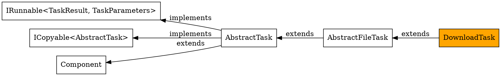

# Implementing a new task

## Introduction
Writing a new task is getting easier by each new task because the given code offers more
and more reusable functionality. That means you also have to rethink the design.
In addition the static code analysis is a great help forcing you to rethink when
duplicate code has been detected or one class does have to many dependencies to other
classes. This article intends to explain how the DownloadTask has been implemented
providing you an example.

## Overview

```dot
digraph G {
    rankdir=LR
    node[shape="box"]
    
    TaskReaderFactory[label="Factory<AbstractBasicTaskReader>"]
    TaskFactory[label="Factory<AbstractTask>"]
    DownloadTask[style="filled"  fillcolor="orange"]
    DownloadTaskCreator[style="filled"  fillcolor="orange"]
    DownloadTaskReader[style="filled"  fillcolor="orange"]
    DownloadTaskReaderCreator[style="filled"  fillcolor="orange"]
    
    AbstractFileTask -> DownloadTask[label="extends" dir="back"]
    DownloadTaskCreator -> DownloadTask[label="creates" style="dashed"]
    ITaskCreator -> DownloadTaskCreator[label="implements" dir="back"]
    AbstractFileTaskReader -> DownloadTaskReader[label="extends" dir="back"]
    DownloadTaskReader -> DownloadTaskCreator[label="uses" style="dashed"]
    ITaskReaderCreator -> DownloadTaskReaderCreator[label="implements" dir="back"]
    DownloadTaskReaderCreator -> TaskFactory[label="uses" style="dashed"]
    TaskFactory -> DownloadTaskReader[label="creates" style="dashed"]
    TaskReader -> TaskReaderFactory[label="uses" style="dashed"]
    TaskReaderFactory -> DownloadTaskReaderCreator[label="creates" style="dashed"]
}
```

The last graphic shows how the different classes are working together.
For the download class following classes have to be implemented in that order:

- DownloadTask
- DownloadTaskCreator
- DownloadTaskReader
- DownloadTaskReaderCreator

## Required Constants

For the different classes following enum classes have to be extended:

 - **TaskType** - that enum has entries representing the type of task. The value of
   each enum reflects also the concrete value used in the YAML document for the type attribute.
   It is also used for the factory mechanism to find task creators and task reader creators.
   For the two creator classes and reader the enum **DOWNLOAD** has been added. 
 - **DocumentReaderFields** - that enum has entries representing the different attributes used
   in a YAML document. The value of each enum reflects the exact name to be used in the YAML
   document. It is used by the different reader to validate the document.
   For the DownloadTaskReader the enum **URL** has been added.

## Implementing the task

For the concrete example the Download task is derived from the **AbstractFileTask** since there
are multiple tasks sharing same attributes like:

 - **destination** - mandatory string attribute - where to write the file to
 - **overwrite** - optional boolean attribute - whether an existing file can be overwritten (default is false)
 - **ensure-path** - optional boolean attribute - whether the destination path is created when missing (default is false)

That's why for the **DownloadTask** just remains the mandatory attribute **url**. In general any
task should now implement following methods:

 - **`public TaskResult run(TaskParameters parameters)`** - the run Method is called by the
   task group which can run tasks in order or in parallel. The task parameters contain all data
   required to allow rendering a text with templating context like the document model (when a model
   has been defined), the current matrix attributes (when a matrix has been configured) the current
   task group variables (when variables are given) and the current with context (when list items
   have been defined at the task attribute **with**). You simply can
   call `parameters.getTemplatingContext())` to get the map that can be easily passed to the
   template engine. The download task allows rendering for the destination path only.
   Important is to call `logTitle(parameters);` because each task has a title (Component base class)
   allowing to see in the logs what task topic is handled. When something goes wrong the run
   method should define `taskResult = new TaskResult(false, getVariable());` returning finally
   that task result; first parameter indicates the success of the task. When all is fine the 
   task variable will be modified: `getVariable().setValue(renderedDestinationPath.toString());`;
   that way further tasks can continue working with the path and filename. For consistency all
   file based tasks should do that. Of course the task result should have **true** then as
   first parameter.
 - **`public AbstractTask copy()` - the copy is important for the situation where the user is
   using the **with** attribute. The problem is here that the task is defined once but executed
   as often as many items are in the list. Since we can run tasks in order or in parallel this
   should also apply for that situation and related to the fact that we also then would have just
   one variable the task will be copied.
 - **`public String toString()`** - the main purpose here is using it for the unit testing
   using a task for **@Parameterized** tests. Read here: [Junit5](junit5.md). 

In general provide reasonable logging that a user can see what is going on (especially when
something goes wrong).

## Implementing the task creator

The creator class is very easy and very small in its implementation. The main purpose 
are two things:

 - The class implements `public AbstractTask create()` to provide a new instance of 
   class **DownloadTask**.
 - An annotation `@Named(TaskType.Constants.DOWNLOAD)` binds the creator to a concrete constant
   which is later on important for the **factory**. The Java **SPI** (Service Provider Interface)
   allows loading registered classed for a concrete interface. In this case for the **ITaskCreator**
   interface there is **magic.systems.hyperion.components.tasks.creator.ITaskCreator** file under
   **src/main/resources/META-INF/services** containing a flat list of classes implementing this
   interface. It necessary to add **magic.system.hyperion.reader.creator.DownloadTaskReaderCreator**
   there to allow the **factory** to find the creator by the name defined in the annotation.

## Implementing the task reader

The reader basically is reading and validating information details from the YAML tree.
The INodeReader provides the interface to accept the current node to be handled.
All task based reader have two information passed from outside:

 - **the taskgroup**: where to add the task that has been read and validated
 - **the task creator**: interface to concrete task creator. You can rely on that the
   creator is compatible to the task; so you are allowed to cast to the concrete one.

The class hierarchy offers you two functionalities:

 - **providing a matcher**: with `protected ListMatcher<String> getMatcher(final JsonNode node)`
   you are able to implement on each level what fields (attributes) are mandatory and which
   ones are optional to be able to validate. Because the base class handled most things it just
   remains for the DownloadTaskReader to add following:
   `matcher.requireExactlyOnce(DocumentReaderFields.URL.getFieldName());`.
   The matcher provides a `matches` method and when that one returns false you can stop reading
   throwing an exception (the YAML format is then wrong).
 - **providing basic read methods**: with `readBasic` and `readFile` the base classes already
   initialize the task with the information found.

For the DownloadTaskReader it remains to read and validate information for the URL
and finally to add the task to the task group.

## Implementing the task reader creator

It's very the same procedure as already explained for the task creator. 

- The class implements `public AbstractBasicTaskReader create()` to provide a new instance of
  class **DownloadTaskReader**. The factory for tasks is used here to search for the concrete
  task creator passing it to the constructor of the reader.
- An annotation `@Named(TaskType.Constants.DOWNLOAD)` binds the creator to a concrete constant
  which is later on important for the **factory**. The Java **SPI** (Service Provider Interface)
  allows loading registered classed for a concrete interface. In this case for the **ITaskReaderCreator**
  interface there is **magic.systems.hyperion.reader.creator.ITaskReaderCreator** file under
  **src/main/resources/META-INF/services** containing a flat list of classes implementing this
  interface. It necessary to add **magic.system.reader.creator.DownloadTaskReaderCreator**
  there to allow the **factory** to find the creator by the name defined in the annotation.
  
## Testing

Now all four classes are created you should be able to process documents with download tasks.
Of course there should be unittests for the task and for the reader. For the reader it is
sufficient to test it in context of reading a document. That's why I implemented following:

 - DownloadTaskTest
 - DocumentReaderForDownloadTaskTests
