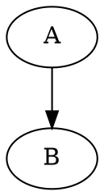
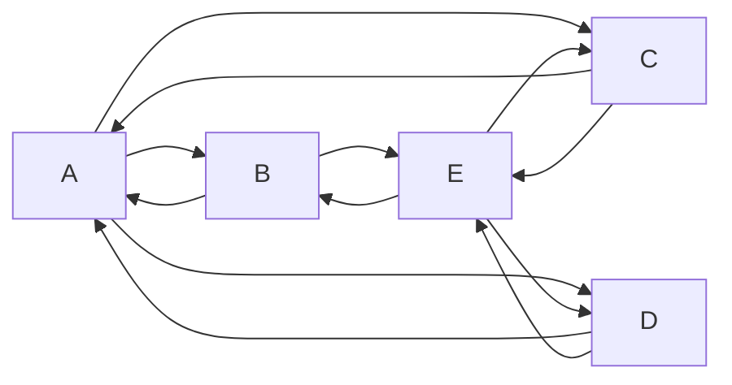

# Mkdocs

## Installation

It requires Python.

```
pip install mkdocs mkdocs-bootswatch mkdocs-graphviz pymdown-extensions mkdocs-mermaid2-plugin mkdocs-autolinks-plugin
```

## Configuration

The configuration of the project is defined in the **mkdocs.yml** in the root
of the repository.

 - At the top you define the meta data of the project like
    - name of the project
    - author of the project
    - Url of the Github pages where these site will be located later on
    - The url of the Github repository.
 - In the middle section you define the navigation:
    - With **Home** the main page is define which you see first.
    - With **Index** you get a menu "Index" in the top bar and all sub menu
      items are those ones listed unter the index entry.
 - At the bottom there are two sections:
   - **theme** is for the look and feel. Therefore the **mkdocs-bootswatch** is needed.
   - **markdown_extensions** are markdown extensions for rendering:
     - **mkdocs_graphviz** is for rendering Graphviz syntax as SVG.
     - **admonition** is for special note boxes.
     - **footnotes** allows writing footnotes [^1]
     - **pymdownx.tilde** for ~~strikethrough~~ with `~~strikethrough~~`
     - pymdownx.caret
     - pymdownx.mark for ==marked== with `==marked==`
     - pymdownx.magiclink for auto creation of links used in markdown code. 
   - **plugins** for plugins like:
     - **mkdocs-mermaid2-plugin** for rendering Mermaid diagrams.
     - **mkdocs-autolinks-plugin** for autolink that you don't have to worry about paths.
       
## Graphviz Example

Following simple example (you have to add **dot** behind the first three backticks):

````
```
digraph D { 
   A -> B;
}
```
````

produces



## Special note boxes

!!! note "Please Note"
    Some note. You have to choose the right indent

!!! warning "Attention"
    Some warning. Please don't ...

!!! error "Problem"
    You are in trouble if ...

generated by

```plain
!!! note "Please Note"
    Some note. You have to choose the right indent

!!! warning "Attention"
    Some warning. Please don't ...

!!! error "Problem"
    You are in trouble if ...
```

## Mermaid example


generated by

````

````

## Testing

It does **build** the site and after that 
you can open your browser at [http://localhost:8000](http://localhost:8000)
to see the result. Changes to  known Markdown files will be recognized,
so you just have to refresh your Browser to see the results.

```
mkdocs serve
```

## Deploying

Later on it should be done automatically via Github workflow with a Github action but
for now I'm doing it on a **gh-pages** branch manually by copying the content
of the **site** folder - generates by **mkdocs build** - into that branch.


## Links

 - https://gitlab.com/rodrigo.schwencke/mkdocs-graphviz
 - https://squidfunk.github.io/mkdocs-material/reference/admonitions
 - https://squidfunk.github.io/mkdocs-material/reference/footnotes/
 - https://facelessuser.github.io/pymdown-extensions/extensions/magiclink/

[^1]: This is footnote one
