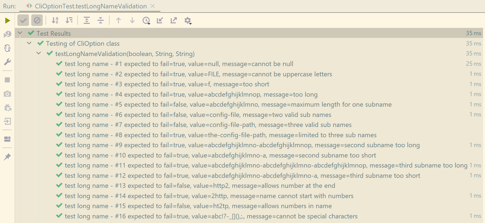

# JUnit5

The setup of Junit5 is explained here: [Build](build.md).

## Default test methods

There is not much to say since the annotation **@Test** is the same
as for Junit4. However one fact is important: ==If you use
**@ParameterizedTest** you cannot use **@Test**==.

## Assertions

The assertions of Junit5 are a lot to feel comfortable;
after here some of them I have used:

| Assertion          | Meaning | Context |
| ------------------ | ------- | ------- |
assertEquals       | Comparing two things to be equal | values
assertNotEquals    | Comparing two things to be unequal | values
assertTrue         | Verify that a condition evaluates to true | condition/state
assertFalse        | Verify that a condition evaluates to false | condition/state
assertNull         | Verify that an instance of something is null | instance
assertNotNull      | Verify that an instance of something is not null | instance
assertThrows       | Verify that a concrete exception has been thrown | exception
assertDoesNotThrow | Verify that no exception is thrown. | exception
assumeTrue         | When condition is false the test is marked as ignored | run/ignore test

!!! note
    Each variant is provided a second one where you can provide a helpful
    message that is shown when the assertion is thrown.

!!! note
    The **assertThrows** also provides the throwable that you additional can
    verify that the concrete message is thrown or whatever information you
    have passed to your exception.

##  Parameterized tests

Parameterized tests are a nice way to write a test method once calling
it several times for different data input. In the list of tests each
variant appears individually given you a clear idea which of the variant
has failed.

```java
    /**
     * Testing validation of the long name.
     *
     * @param bExpectedToFail when true then expected to fail.
     * @param strValue value for long name.
     * @param strMessage hint for the case the assertion does fail.
     */
    @ParameterizedTest(
            name = "test long name - #{index} expected to fail={0}, value={1}, message={2}")
    @MethodSource("provideLongNameValidationTestData")
    public void testLongNameValidation(
            final boolean bExpectedToFail,
            final String strValue,
            final String strMessage) {
        // setup of builder
        final var builder = CliOption.builder();
        builder.setShortName("x");
        builder.setDescription("test");
        builder.setLongName(strValue);

        if (bExpectedToFail) {
            assertThrows(CliException.class, builder::build, strMessage);
        } else {
            assertDoesNotThrow(builder::build, strMessage);
        }
    }
```

The given code is taken from Hyperion and you can see following:

 - The annotation **@ParametrerizedTest** with the name value specifying how
   the test is displayed in the IDE. The curly braces are substituted by the
   values passes as parameters to the test function. The **{index}** is a
   special parameter to allow the visualize the nth call of the test method.
 - The annotation **@MethodSource** is to specify a static method that does
   provide the test data.
 - For being able to control how the assertion should work a boolean is passed
   as well telling the method what kind of assertion is wanted. In given example
   there is an exception thrown when the test is expected to fail otherwise it will
   be verified that no exception is thrown when test is expected to succeed.
   

!!! note
    It's to say that the visualization of the parameterized test does
    not necessarily work on all IDE. That's why I have been switching to Intellij
    where it is working well.

!!! note
    The annotation **@DisplayName** doesn't work well in the IDE (for now) on
    the test method; that's why I did place a name in front of the index.

    However it has to be placed on the class otherwise the Maven build shows
    **null** instead of the class name.

The following code is the relating function providing the test data:

```java
    /**
     * Test data for long name validation.
     *
     * @return test data.
     */
    private static Stream<Arguments> provideLongNameValidationTestData() {
        //CHECKSTYLE.OFF: MultipleStringLiterals - ok here.
        return Stream.of(
                Arguments.of(true, null, "cannot be null"),
                Arguments.of(true, "FILE", "cannot be uppercase letters"),
                Arguments.of(true, "f", "too short"),
                Arguments.of(true, "abcdefghijklmnop", "too long"),
                Arguments.of(false, "abcdefghijklmno",
                        "maximum length for one subname"),
                Arguments.of(false, "config-file", "two valid sub names"),
                Arguments.of(false, "config-file-path", "three valid sub names"),
                Arguments.of(true, "the-config-file-path",
                        "limited to three sub names"),
                Arguments.of(true, "abcdefghijklmno-abcdefghijklmnop",
                        "second subname too long"),
                Arguments.of(true, "abcdefghijklmno-a",
                        "second subname too short"),
                Arguments.of(true,
                        "abcdefghijklmno-abcdefghijklmno-abcdefghijklmnop",
                        "third subname too long"),
                Arguments.of(true, "abcdefghijklmno-abcdefghijklmno-a",
                        "third subname too short"),
                Arguments.of(false, "http2", "allows number at the end"),
                Arguments.of(true, "2http", "name cannot start with numbers"),
                Arguments.of(false, "ht2tp", "allows numbers in name"),
                Arguments.of(true, "abc!?-_[](),;.",
                        "cannot be special characters")
        );
        //CHECKSTYLE.ON: MultipleStringLiterals
    }
```

Following information should be recognized:

 - The function is - of course - private and **it must be static**.
 - The return value is a **Stream<Arguments>**!
 - The function does return a **Stream()** something.
 - Each entry enforces a call of the test method and the parameters
   for one call are **Arguments.of()** something.
 - You don't need to but I organized to have the explaining message
   as one parameter. It appears in the list of tests as parameters as well
   as it is shown for the case that the test does fail because the
   message is passed to the.

## How it looks like in an IDE



## Assuming

You might have the problem that a test depends on a certain setup of
the system. Let's say you do not have Docker installed on your system
then this test detects that and the concrete assertion will automatically
mark the tests as ignored.

```java
@Test
public void testDockerForTargetUnix() {
    assumeTrue(Capabilities.hasDocker());
    // test code
}
```

## OS specific tests

There are test that can run on specific systems only. JUnit5
is capable to detect the system and you can use the annotation
**@EnabledOnOs** to specify on which system the test should run.

```java
@DisplayName("Testing UnixShellTask")
@EnabledOnOs({OS.LINUX, OS.MAC})
public class UnixShellTaskTest {
    // test code
}
```

and

```java
@DisplayName("Testing WindowsBatchTask")
@EnabledOnOs(OS.WINDOWS)
public class WindowsBatchTaskTest {
    // test code
}
```

## Code Coverage

Also explained in [Build](build.md) the awareness should here be raised
that unit tests running on multiple environments and multiple platforms
might lead to multiple coverage results. On Windows the class **UnixShellTask**
is not tested (as an example). There for you can organize a profile
which - at least - allows you to have different coverage limits depending
on the platform.

## Order of test methods

It's not obvious but there is an algorithm defining an order.
However tests should be independent and therefor a random order is probably
a better solution:

```java
@DisplayName("Testing of CliOption class")
@TestMethodOrder(value = MethodOrderer.Random.class)
public class CliOptionTest {
    // test code
}
```

!!! note "Please note"
    When a test fails the logging prints the seed that has been used to run
    the methods in random order that you are able to re-run the tests in same
    order when the problem did arrive. You have to set the property 
    **junit.jupiter.execution.order.random.seed** then.

It's also possible to define random order of test classes.
That can be defined in the pom.xml at the **surefire** Maven plugin
with the configuration option `<runOrder>random</runOrder>`.

