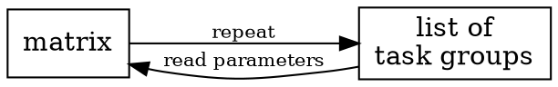

# Matrix

## Example
```yaml
---
matrix:
  - title: first run
    parameters:
      description: the first run
      sayHelloWorldCount: 3
  - title: second run
    parameters:
      description: the second run
      sayHelloWorldCount: 2

taskgroups:
  - title: test group one
    tasks:
      - type: groovy
        title: running a Groovy task
        code: |
          println 'Groovy:{{ matrix.description }}'
          for (int ix = 1; ix <= {{ matrix.sayHelloWorldCount }}; ++ix) {
            println 'hello world ' + ix + '!'
          }
```

## Setup

  - A matrix starts with the element matrix placed on same level as taskgroups.
  - A matrix is a list.
  - Each matrix item has two fields: **title** and **parameters**.
  - The value for **parameters** is a key/value map (keys and values are interpreted as strings).

## Behaviour



  - For each matrix item all existing task groups are running again.
  - All variables stored in a previous run (per task group) are dropped.
